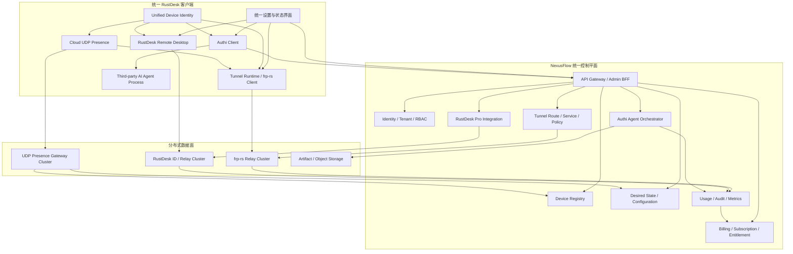
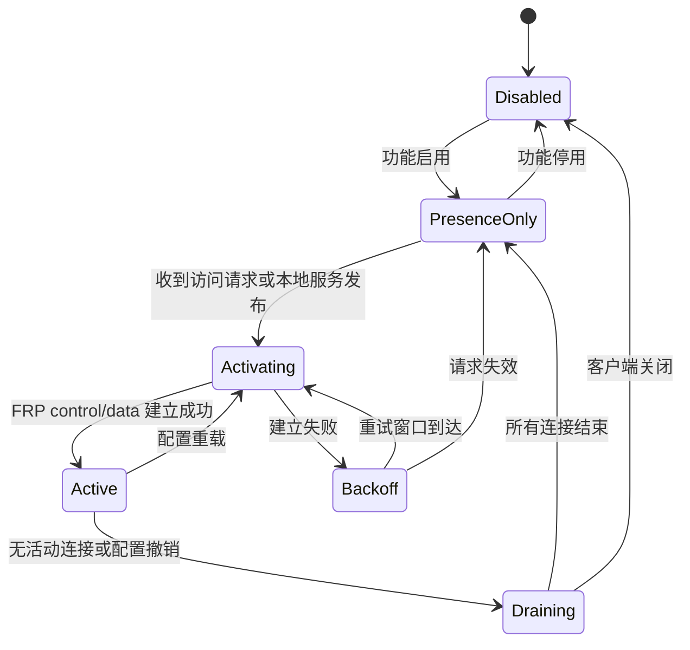

# NexusFlow 统一系统方案

> 文档状态：总体方案基线  
> 版本：1.0  
> 日期：2026-08-10  
> 适用范围：`rustdesk`、`cloud`、`frp-rs`、`authi` 四个现有子项目的统一产品化改造

## 1. 文档目的

本文档定义 NexusFlow 的统一系统方案，用于指导以下四类能力形成一个可商业运营的产品体系：

1. RustDesk 远程桌面控制；
2. CloudProxy 与 frp-rs 合并后的局域网代理、服务发布和穿透能力；
3. Authi 的移动端/Web 端控制、AI Agent 会话和任务编排能力；
4. 统一用户、设备、权限、订阅、计费、审计和后台管理能力。

本文档是架构和实施基线，不要求将四个原项目源码原样保留，也不要求简单合并 Cargo workspace。允许围绕 RustDesk 主体重构模块边界、协议、数据模型和部署方式。

## 2. 已确认的项目约束

以下内容已经确认，应作为后续设计和实现不可偏离的约束。

### 2.1 用户端约束

- 以 RustDesk 客户端为主体。
- RustDesk 原生设备 ID、服务生命周期、GUI/Service 关系、无人值守、UAC、登录界面和构建入口保持原生一致。
- Cloud 与 frp-rs 必须合并为一个穿透子服务，对用户只呈现一个功能。
- Cloud/frp-rs 客户端不能继续作为独立用户端进程运行，应以内嵌库或模块形式接入 RustDesk 的原生运行架构。
- Authi 客户端能力可以并入 RustDesk。
- 第三方 AI Agent 不要求与 RustDesk 运行在同一个进程中。Authi 负责启动第三方 Agent，并接管其输入、输出、会话和退出状态。
- 用户只安装和管理一个产品，不需要分别配置 RustDesk、CloudProxy、frpc 和 Authi 客户端。

### 2.2 后端约束

- 后端不要求严格单进程，目标形态是可横向扩展的分布式服务。
- 所有后端服务必须属于同一个控制平面，使用统一账户、设备、权限、套餐和审计模型。
- Relay、Presence、RustDesk ID/Relay、Agent 调度等高负载服务可以独立部署和扩容。
- 后台管理界面必须统一，不能要求运营人员分别登录多个互不关联的后台。

### 2.3 RustDesk Server Pro 约束

- RustDesk Server Pro 可获得完整授权，允许使用其正式 API、服务端能力以及授权范围内的源码和管理功能。
- RustDesk Server Pro 应作为远程桌面领域能力的重要基础。
- `rustdesk/doc.rustdesk.com` 是文档、官网和产品说明站点，不是商业业务后端。
- 可以借鉴或复用授权范围内的 RustDesk Pro Console 页面与交互，但统一商业控制面不能建立在静态文档站源码之上。

## 3. 项目现状评估

### 3.1 CloudProxy

`cloud/doc/CloudProxy_upgrade_plan.md` 已经给出从透传原型升级到代理管理平台的完整目标，包括：

- CPC-A 客户端接入模式；
- CPC-P 服务发布模式；
- CPS 控制面、设备管理、路由调度和代理入口；
- 账户、成员、设备、路由、服务和权限；
- UDP 低资源注册、心跳和命令通知；
- 配置版本、主动拉取和安全控制；
- 临时访问、流量统计和审计；
- 持久化数据库和 Web 管理系统。

当前 CloudProxy 代码仍属于原型实现，主要具备 UDP 注册/心跳、基于 `nas_uuid` 的会话维护和 TCP 透传。现有实现不具备完整的账户、租户、设备凭据、路由、服务、权限、订阅和审计数据模型，也缺少生产级生命周期、错误处理和安全认证。

结论：CloudProxy 升级文档保留为产品需求和控制面设计依据；现有 Cloud 数据转发实现不作为最终主数据面。

### 3.2 frp-rs

frp-rs 已具备更完整的穿透数据面，包括 TCP、UDP、HTTP、HTTPS、STCP、SUDP、XTCP、TCPMux、KCP 和 QUIC 等能力。客户端 `ClientService` 已提供运行、重载、取消和状态管理，服务端提供可嵌入的绑定和关闭接口。

frp-rs 的优势是代理数据通道和运行时，不是商业控制面。其配置模型不能直接替代账户、设备、服务路由、权限、订阅、审计和计费数据库。

结论：frp-rs 作为统一 Tunnel Service 的数据面核心；不单独对用户暴露 frp 产品概念和原生管理后台。

### 3.3 RustDesk

RustDesk 是统一客户端主体。其原生设备 ID、远程控制协议、平台服务、权限提升、无人值守和构建体系均应保留。新的 Tunnel Service 和 Authi Client 应适配 RustDesk，而不是反向重写 RustDesk 的基础运行模型。

RustDesk Server Pro 文档表明其具备 Account、Web Console、API、OIDC、LDAP、2FA、设备管理、策略、权限、审计、多 Relay 和 License 等商业功能。由于已确认可以获得完整授权，这些能力可以在统一平台中深度复用。

结论：RustDesk 客户端是统一用户端宿主；RustDesk Server Pro 是远程桌面服务域基础。

### 3.4 authi-server

authi-server 当前已有以下适合作为控制平面基础的能力：

- HTTP API；
- Socket.IO 实时通信；
- auth、account、session、machine、access key、usage；
- PostgreSQL、Redis、S3/MinIO；
- presence、background jobs、health、metrics；
- Agent/OpenClaw/orchestrator 等任务和会话能力。

当前 authi-server 尚未覆盖完整商业闭环，包括租户级 RBAC、产品套餐、订阅、权益、订单、支付回调、发票、退款和欠费治理。

结论：authi-server 演进为统一商业控制平面，而不是仅作为 AI Agent 后端存在。

## 4. 总体设计原则

### 4.1 一个产品，多个独立服务能力

远程桌面、网络穿透和 AI Agent 是独立业务能力，但它们必须共享：

- 一个用户账户；
- 一个组织/租户；
- 一个统一设备身份；
- 一套设备凭据；
- 一套权限和套餐权益；
- 一个客户端配置入口；
- 一个管理后台；
- 一套审计和用量系统。

### 4.2 控制面与数据面分离

- 统一控制平面管理身份、配置、路由、权限、调度、用量和商业状态。
- RustDesk Relay 和 frp-rs Relay 负责高吞吐数据转发。
- Cloud UDP Presence 只承担低资源在线保持、版本通知和唤醒，不承载复杂业务配置和大流量数据。
- AI Agent 的第三方进程由客户端监督，不进入网络 Relay 数据面。

### 4.3 保持 RustDesk 原生兼容

- 不改变 RustDesk 原生 ID 对外行为。
- 不破坏现有 RustDesk Server/Client 协议兼容性。
- 不改变现有平台服务入口和权限提升方式。
- 新能力通过内部模块、适配器和已有 IPC 边界接入。

### 4.4 先模块化，后按负载拆分

初期优先在统一代码库和统一控制平面中形成清晰模块，减少过早的分布式复杂度。随着用户量和流量增长，再将 Presence、Relay、Telemetry、Billing 等模块拆为独立服务。拆分前后 API、事件和数据归属保持一致。

## 5. 目标总体架构



## 6. 统一客户端方案

### 6.1 客户端宿主

RustDesk 保持原生入口和进程拓扑。新的功能应进入 RustDesk 已有的长期运行服务边界，由 RustDesk 负责启动、停止、更新和系统权限。

建议形成以下内部模块：

```text
RustDesk Client
├── rustdesk-core                    原生远程桌面能力
├── unified-device-identity          统一设备身份和凭据
├── tunnel-service
│   ├── presence-client              Cloud UDP Presence
│   ├── desired-state-client         配置与命令拉取
│   └── frp-client-runtime           frp-rs ClientService
├── authi-client
│   ├── agent-session
│   ├── task-control
│   └── agent-supervisor             第三方进程管理
├── unified-config                   统一配置
└── unified-ui                       统一设置、状态和诊断入口
```

以上是逻辑模块，不要求每个模块单独形成 crate。优先复用 RustDesk 现有模块和生命周期，仅在边界稳定且需要独立测试时拆 crate。

### 6.2 进程策略

- 不运行独立 `cloud-client`、`frpc` 或 Tunnel daemon。
- Cloud Presence 和 frp-rs ClientService 运行在 RustDesk 原生长期服务进程中。
- GUI 继续通过 RustDesk 原有 IPC 查询和修改状态。
- 第三方 AI Agent 作为外部子进程运行，由 Agent Supervisor 管理 stdin、stdout、stderr、退出码、超时和强制终止。
- Agent 进程崩溃不得影响 RustDesk 远程桌面和 Tunnel Service。

### 6.3 统一客户端生命周期

建议由一个 RustDesk 内部协调器管理新增模块：

```text
启动 RustDesk 服务
  -> 加载设备身份和本地凭据
  -> 启动 Cloud Presence
  -> 拉取 Desired State
  -> 按策略初始化 Tunnel Service
  -> 初始化 Authi Client
  -> 上报统一能力和版本

配置变化
  -> Presence 返回 config_version / route_version
  -> 客户端通过 HTTPS 主动拉取
  -> 校验签名和版本
  -> 原子应用配置
  -> 必要时 reload frp-rs generation

退出 RustDesk 服务
  -> 停止接受新 Agent 任务
  -> 结束或交接 Agent 会话
  -> Tunnel 进入 draining
  -> 关闭 frp-rs runtime
  -> 停止 Presence
  -> 保留最后一次有效配置
```

### 6.4 Tunnel Runtime 状态机



状态含义：

- `Disabled`：Tunnel 功能关闭；
- `PresenceOnly`：只维持低频 UDP 心跳；
- `Activating`：拉取配置并建立 FRP control/data runtime；
- `Active`：存在有效代理或访问连接；
- `Draining`：停止接收新连接，等待已有连接结束；
- `Backoff`：网络或认证失败后的有限退避。

### 6.5 客户端统一配置

客户端只保留一个产品配置入口。建议本地配置分为：

```text
identity        RustDesk ID、device_uid、设备公钥标识
control_plane   API/Presence 地址和租户绑定信息
remote_desktop  RustDesk 原生配置
tunnel          Tunnel 启用状态、本地服务和本地策略
agent           Agent 命令、工作目录、资源限制
policy_cache    服务端策略和最后有效版本
```

服务端 Desired State 优先管理商业和安全策略；允许用户修改的本地字段必须明确白名单。服务端配置应用失败时保留上一版本，禁止部分覆盖导致设备失联。

## 7. Cloud 与 frp-rs 合并方案

### 7.1 合并后的产品定义

Cloud 与 frp-rs 合并为 `Tunnel Service`：

- Cloud 提供 UDP Presence、低资源在线保持、版本通知和唤醒机制；
- frp-rs 提供所有实际代理连接和数据转发；
- 统一控制平面提供账户、设备、服务、路由、权限、令牌、配置和审计；
- 用户、管理员和 API 不再看到两个独立子系统。

### 7.2 CPC-A 映射

CPC-A 表示客户端接入设备，映射到 frp-rs visitor 或本地访问代理：

```text
本地浏览器/数据库客户端/App
  -> RustDesk 内嵌 Tunnel Service 本地监听
  -> frp-rs visitor/control
  -> Relay
  -> 目标 CPC-P
  -> 目标本地服务
```

首期支持本地 TCP/UDP 监听；后续按明确需求增加 SOCKS5、HTTP CONNECT 和应用层代理。避免在首期同时实现所有代理协议。

### 7.3 CPC-P 映射

CPC-P 表示服务发布设备，映射到 frp-rs proxy：

- TCP 服务；
- UDP 服务；
- HTTP/HTTPS 虚拟主机；
- 受保护的 STCP/SUDP；
- 在网络条件允许时使用 XTCP；
- KCP/QUIC 作为可选传输。

客户端不得提交任意目标地址。每个发布服务必须由统一控制平面定义或批准，并限制到允许的本地地址、端口和协议。

### 7.4 UDP Presence 协议职责

Presence 协议只负责：

- 注册或恢复设备会话；
- 低频心跳；
- 上报版本、能力和轻量状态；
- 返回 `config_version`、`route_version`、待处理命令数量；
- 通知客户端主动拉取配置；
- 发送有限的紧急唤醒提示；
- 报告配置应用结果。

Presence 协议不负责：

- 传输完整复杂配置；
- 长期保存业务数据；
- 直接承载代理数据；
- 通过 UDP 明文发送账户密码；
- 依赖服务端始终能够穿透 NAT 主动推送。

### 7.5 按需数据通道

空闲设备只维持 Presence。发生以下事件之一时启动 frp-rs runtime：

- 管理员或用户请求访问 CPC-P 服务；
- CPC-A 发起对远程服务的连接；
- 配置要求某个服务保持常驻；
- 设备正在承载已有业务连接；
- 策略要求预热数据通道。

最后一个连接关闭并超过空闲超时后，进入 Draining，随后释放 FRP control/data runtime，回到 PresenceOnly。

### 7.6 配置生成和应用

统一控制平面保存业务域配置，不直接把原始 frp 配置作为数据库主模型。Tunnel Orchestrator 根据设备、服务、路由和权限生成 frp-rs 运行配置。

```text
Service + Route + Policy + Relay Assignment
                    │
                    ▼
            Tunnel Config Compiler
                    │
                    ▼
          versioned frp-rs ClientConfig
                    │
                    ▼
              ClientService.reload()
```

配置必须具备：

- 单调递增版本；
- 内容摘要；
- 服务端签名；
- 生效时间和过期时间；
- 回滚版本；
- 应用结果和错误原因。

### 7.7 服务端 Relay

frp-rs Server 作为独立可扩展 Relay 节点运行。Relay 节点：

- 向控制平面注册自身区域、容量、版本和能力；
- 接收短期配置或从控制平面拉取；
- 校验设备和短期连接令牌；
- 上报连接数、字节数、错误率和延迟；
- 不直接管理用户、订阅和长期设备信息；
- 不向运营人员暴露独立商业后台。

## 8. 统一身份与设备 ID

### 8.1 双层 ID 模型

为保持 RustDesk 原生兼容并满足后台稳定关联，采用双层模型：

| 字段 | 用途 | 对外可见 | 是否可变 |
|---|---|---:|---:|
| `device_uid` | 后台内部数据库主键，建议 UUID/ULID | 否 | 否 |
| `rustdesk_id` | RustDesk 原生设备 ID，也是统一产品公开设备 ID | 是 | 遵循 RustDesk 原生规则 |
| `cloud_nas_uuid` | Cloud 旧版本兼容标识 | 否 | 迁移后只读 |
| `authi_machine_id` | Authi 旧机器标识 | 否 | 迁移后只读 |
| `frp_client_id` | 当前 Tunnel runtime 标识 | 否 | 可轮换 |

所有 UI 和外部业务 API 使用 `rustdesk_id` 查找设备；所有数据库关系和安全凭据使用 `device_uid`。即使未来 RustDesk ID 发生合法迁移，历史审计、订阅和设备归属仍保持稳定。

### 8.2 设备注册和绑定

```text
首次启动
  -> 保持 RustDesk 原生 ID 生成流程
  -> 本地生成设备密钥对
  -> 向控制平面提交 rustdesk_id、公钥和能力摘要
  -> 控制平面创建 device_uid
  -> 用户通过一次性绑定令牌绑定到账户/租户
  -> 控制平面签发设备凭据
  -> 客户端安全保存 device_uid 和凭据
```

硬件信息只能作为风险信号，不能作为唯一身份。上传时使用摘要，不保存不必要的原始硬件序列号。

### 8.3 统一设备能力

设备注册时上报能力，例如：

```text
remote_desktop
tunnel_access
tunnel_publish
agent_control
tcp_proxy
udp_proxy
http_proxy
quic_transport
platform_windows/macos/linux/android
```

控制平面根据客户端版本、平台、套餐和策略决定实际启用能力。

## 9. 统一控制平面

### 9.1 演进目标

建议将 `authi-server` 演进为 `nexus-control-plane`。名称调整不影响初期目录结构，可以先在现有 authi-server 中建立模块，等服务边界稳定后再重命名或拆分。

### 9.2 逻辑模块

```text
nexus-control-plane
├── identity
│   ├── users
│   ├── accounts
│   ├── tenants
│   ├── memberships
│   └── rbac
├── devices
│   ├── registry
│   ├── credentials
│   ├── capabilities
│   └── desired-state
├── remote-desktop
│   └── rustdesk-pro adapter/modules
├── tunnel
│   ├── services
│   ├── routes
│   ├── policies
│   ├── access-grants
│   ├── relay-registry
│   └── config-compiler
├── agent
│   ├── sessions
│   ├── jobs
│   ├── artifacts
│   └── orchestrator
├── commercial
│   ├── products
│   ├── plans
│   ├── subscriptions
│   ├── entitlements
│   ├── licenses
│   ├── invoices
│   └── payments
└── governance
    ├── usage
    ├── audit
    ├── metrics
    └── alerts
```

### 9.3 初期部署与后续拆分

首期可将以下模块保留在一个控制平面服务中：

- Identity；
- Device Registry；
- Desired State；
- Tunnel Orchestrator；
- Authi Agent Orchestrator；
- Billing/Entitlement；
- Admin API。

优先独立部署：

- UDP Presence Gateway；
- frp-rs Relay；
- RustDesk ID/Relay；
- 对象存储；
- 指标和日志管道。

达到实际容量或故障隔离要求后，再拆分 Identity、Billing、Telemetry 等控制面模块。

## 10. RustDesk Server Pro 集成

### 10.1 定位

RustDesk Server Pro 负责远程桌面领域：

- RustDesk 设备注册和在线状态；
- 远程桌面 ID/Relay；
- 地址簿和设备组；
- 远程访问策略；
- 远程控制权限；
- 连接和文件传输审计；
- RustDesk 客户端策略下发；
- RustDesk Pro License 能力。

### 10.2 账户统一

平台只能存在一个商业账户事实来源。推荐由统一 Identity 模块维护用户、租户和成员，RustDesk Pro 使用以下方式之一接入：

1. 直接改造 RustDesk Pro 账户模块，使用统一 Identity；
2. 使用 OIDC/SSO 将 RustDesk Pro Console 接入统一账户；
3. 由控制平面通过正式 API 同步必要用户和设备，但禁止双向自由修改。

优先级为 1 > 2 > 3。最终选择取决于获得的 RustDesk Pro 源码边界和其账户模块耦合程度。

### 10.3 设备统一

RustDesk Pro 设备记录通过 `rustdesk_id` 和 `device_uid` 与统一 Device Registry 对齐。RustDesk 专有字段保留在远程桌面领域，不复制到所有通用设备表。

### 10.4 License 与 Entitlement

RustDesk Pro License 不直接作为整个 NexusFlow 套餐模型。统一商业模块根据订阅生成 Entitlement，再映射到 RustDesk Pro、Tunnel 和 Agent：

```text
Subscription
  -> Entitlements
      -> remote_desktop.max_devices
      -> remote_desktop.concurrent_sessions
      -> tunnel.enabled
      -> tunnel.monthly_traffic
      -> tunnel.max_services
      -> agent.enabled
      -> agent.monthly_usage
```

RustDesk Pro License 是远程桌面能力的执行凭据或授权来源之一，统一 Entitlement 是平台最终的商业判定依据。

## 11. Authi 集成

### 11.1 客户端

Authi 客户端能力并入 RustDesk，复用统一设备身份、凭据存储、配置和连接状态。Authi 不再维护独立的机器注册流程。

### 11.2 Agent Supervisor

Agent Supervisor 负责：

- 校验任务授权；
- 按允许列表选择 Agent 程序；
- 设置工作目录和环境变量；
- 启动第三方 Agent 进程；
- 接管 stdin/stdout/stderr；
- 传输终端尺寸、控制信号和退出状态；
- 执行超时、资源限制和取消；
- 记录任务审计和产物元数据；
- Agent 崩溃后隔离故障，不重启 RustDesk 主服务。

### 11.3 服务端

保留 authi-server 已有 session、machine、realtime、usage、artifact、openclaw 和 orchestrator 能力，但逐步完成：

- `machine_id` 向 `device_uid` 迁移；
- 账户权限向统一 Tenant/RBAC 迁移；
- Agent 用量接入 Entitlement；
- Agent 审计接入统一 Audit；
- Agent 产物继续使用 S3/MinIO 或兼容对象存储。

## 12. 数据模型

### 12.1 账户与组织

| 实体 | 关键字段 | 说明 |
|---|---|---|
| `users` | `id`, `email`, `status` | 自然人身份 |
| `accounts` | `id`, `owner_user_id`, `status` | 个人或商业账户 |
| `tenants` | `id`, `account_id`, `name` | 组织/租户边界 |
| `memberships` | `tenant_id`, `user_id`, `role_id` | 成员关系 |
| `roles` | `id`, `tenant_id`, `name` | 内置或自定义角色 |
| `permissions` | `code`, `scope` | 细粒度权限定义 |

### 12.2 设备与身份

| 实体 | 关键字段 | 说明 |
|---|---|---|
| `devices` | `device_uid`, `rustdesk_id`, `tenant_id`, `status` | 统一设备主记录 |
| `device_aliases` | `device_uid`, `alias_type`, `alias_value` | Cloud/Authi/FRP 旧 ID 映射 |
| `device_credentials` | `device_uid`, `key_id`, `public_key`, `status` | 设备密钥和轮换状态 |
| `device_capabilities` | `device_uid`, `capability`, `version` | 客户端能力 |
| `device_bindings` | `device_uid`, `tenant_id`, `bound_at` | 设备归属历史 |
| `device_presence` | `device_uid`, `gateway_id`, `last_seen`, `version` | 在线状态快照 |
| `device_configs` | `device_uid`, `version`, `content_hash`, `status` | Desired State 版本 |

`device_presence` 的实时状态保存在内存或 Redis，PostgreSQL 只批量保存必要快照和历史，禁止每次心跳写数据库。

### 12.3 Tunnel

| 实体 | 关键字段 | 说明 |
|---|---|---|
| `tunnel_services` | `id`, `publisher_device_uid`, `protocol`, `local_target` | CPC-P 发布服务 |
| `tunnel_routes` | `id`, `source_device_uid`, `service_id`, `priority` | CPC-A 到 CPC-P 路由 |
| `tunnel_policies` | `id`, `tenant_id`, `rules`, `version` | 网络访问策略 |
| `tunnel_access_grants` | `id`, `route_id`, `subject`, `expires_at` | 临时或长期授权 |
| `tunnel_sessions` | `id`, `route_id`, `relay_node_id`, `state` | 当前数据连接会话 |
| `relay_nodes` | `id`, `region`, `capacity`, `status` | FRP Relay 注册信息 |
| `tunnel_config_versions` | `device_uid`, `version`, `hash` | 编译后的客户端配置版本 |

### 12.4 RustDesk

RustDesk Pro 原生数据优先保留在其领域模型。统一控制平面只保存必要关联：

| 实体 | 关键字段 | 说明 |
|---|---|---|
| `rustdesk_devices` | `device_uid`, `rustdesk_id`, `server_id` | 设备关联 |
| `remote_sessions` | `id`, `source_device_uid`, `target_device_uid` | 统一会话索引 |
| `remote_policies` | `tenant_id`, `rustdesk_policy_ref` | 策略引用 |
| `remote_audit_refs` | `event_id`, `rustdesk_log_ref` | 审计关联 |

### 12.5 Agent

| 实体 | 关键字段 | 说明 |
|---|---|---|
| `agent_profiles` | `id`, `tenant_id`, `executable_policy` | 可执行 Agent 定义 |
| `agent_jobs` | `id`, `device_uid`, `requested_by`, `state` | Agent 任务 |
| `agent_sessions` | `id`, `job_id`, `started_at`, `ended_at` | 实时会话 |
| `agent_artifacts` | `id`, `job_id`, `object_key` | 任务产物 |
| `agent_usage` | `job_id`, `usage_type`, `quantity` | Agent 用量 |

### 12.6 商业运营

| 实体 | 关键字段 | 说明 |
|---|---|---|
| `products` | `id`, `code` | Remote、Tunnel、Agent 等产品 |
| `plans` | `id`, `product_id`, `billing_cycle` | 套餐 |
| `plan_entitlements` | `plan_id`, `feature_code`, `limit` | 套餐能力和额度 |
| `subscriptions` | `id`, `account_id`, `plan_id`, `status` | 订阅状态 |
| `entitlements` | `account_id`, `feature_code`, `value`, `expires_at` | 实际生效权益 |
| `invoices` | `id`, `account_id`, `amount`, `status` | 账单 |
| `payment_events` | `provider`, `event_id`, `status` | 支付回调幂等记录 |
| `usage_buckets` | `account_id`, `metric`, `period`, `quantity` | 汇总用量 |

## 13. API 与事件边界

### 13.1 管理 API

建议统一前缀：

```text
/api/v1/auth/*
/api/v1/accounts/*
/api/v1/tenants/*
/api/v1/devices/*
/api/v1/remote-desktop/*
/api/v1/tunnel/services/*
/api/v1/tunnel/routes/*
/api/v1/tunnel/access-grants/*
/api/v1/agent/jobs/*
/api/v1/subscriptions/*
/api/v1/usage/*
/api/v1/audit/*
```

管理前端只访问 API Gateway/Admin BFF，不直接连接 Relay 数据库或 RustDesk Pro 私有数据库。

### 13.2 设备 API

```text
POST /api/v1/device/register
POST /api/v1/device/bind
POST /api/v1/device/token/refresh
GET  /api/v1/device/desired-state
POST /api/v1/device/desired-state/result
POST /api/v1/device/capabilities
POST /api/v1/device/diagnostics
```

设备 API 使用设备凭据，不使用用户浏览器 Token。

### 13.3 内部事件

首期可使用现有数据库事务和进程内事件；当服务拆分后再使用可靠消息系统。建议稳定以下事件语义：

```text
device.registered
device.bound
device.presence.changed
device.config.changed
tunnel.service.changed
tunnel.route.changed
tunnel.session.started
tunnel.session.ended
remote.session.started
remote.session.ended
agent.job.created
agent.job.completed
usage.bucket.closed
subscription.changed
entitlement.changed
audit.event.created
```

所有消费方必须按事件 ID 幂等处理。计费和权益事件必须支持重放和对账。

## 14. 统一管理后台

### 14.1 定位

新建统一 `admin-web`。RustDesk Pro Console 可以作为远程桌面页面和交互基础，`doc.rustdesk.com` 继续作为公开文档/官网，不承担业务后台职责。

### 14.2 页面结构

```text
总览
├── 用户与组织
│   ├── 用户
│   ├── 组织/租户
│   ├── 成员
│   └── 角色与权限
├── 设备
│   ├── 设备列表
│   ├── 在线状态
│   ├── 设备详情
│   ├── 统一配置
│   └── 诊断
├── 远程桌面
│   ├── 地址簿
│   ├── 设备组
│   ├── 策略
│   ├── 会话
│   └── RustDesk 审计
├── Tunnel
│   ├── 服务发布
│   ├── 客户端接入
│   ├── 路由
│   ├── 临时访问
│   ├── 活动连接
│   └── Relay 节点
├── AI Agent
│   ├── Agent 配置
│   ├── 任务
│   ├── 会话
│   └── 产物
├── 商业运营
│   ├── 产品
│   ├── 套餐
│   ├── 订阅
│   ├── 权益
│   ├── 账单
│   └── 支付事件
└── 运营治理
    ├── 用量
    ├── 审计
    ├── 告警
    └── 系统状态
```

### 14.3 统一设备详情

同一设备页面应同时显示：

- RustDesk 原生 ID 和远程桌面状态；
- Tunnel Presence、发布服务、访问路由和活动连接；
- Agent 在线状态、任务和会话；
- 当前套餐权益；
- 客户端版本和能力；
- 最近审计、错误和诊断；
- 设备配置版本。

## 15. 商业运营与计费

### 15.1 产品模型

建议定义三个可组合产品域：

```text
Remote Desktop
Tunnel
AI Agent Control
```

套餐可以单独销售，也可以形成组合套餐。商业判断必须通过 Entitlement 完成，客户端不得只依赖本地配置判断付费能力。

### 15.2 权益校验点

- 设备注册或绑定数量；
- RustDesk 并发远程会话；
- Tunnel 服务数量；
- Tunnel 并发连接数；
- Tunnel 月度流量；
- 高级协议和专属 Relay；
- Agent 设备数量；
- Agent 月度任务或资源用量；
- 审计保留时间；
- API 和企业身份功能。

### 15.3 支付集成

支付服务使用 Provider Adapter，避免业务代码直接绑定单一支付渠道。必须具备：

- Checkout/支付单创建；
- 支付回调签名校验；
- `provider + event_id` 幂等；
- 订阅创建、续费、升级、降级和取消；
- 退款和争议；
- 回调丢失后的主动对账；
- Invoice 和 Payment Event 审计；
- 支付成功后原子更新 Subscription 和 Entitlement。

### 15.4 欠费和降级

欠费不应立即切断进行中的远程桌面或数据连接。建议流程：

```text
Active
  -> PastDue（保留宽限期）
  -> Restricted（禁止创建新连接/任务）
  -> Suspended（停止付费能力，保留数据）
  -> Cancelled
```

安全管理、登录、账单查看和数据导出不应因欠费被完全阻断。

## 16. 安全设计

### 16.1 设备认证

- 每台设备生成独立密钥对；
- 注册和绑定使用一次性令牌；
- 长期设备凭据支持轮换和吊销；
- FRP 使用控制平面签发的短期连接令牌；
- RustDesk 原生安全协议保持不变；
- 禁止硬编码共享密码；
- 设备唯一 ID 不是认证凭据。

### 16.2 Presence 安全

- 使用紧凑二进制或 CBOR；
- UDP 包限制最大长度；
- 注册前使用无状态 Cookie Challenge；
- 防止源地址伪造和反射放大；
- 按 IP、设备和租户限速；
- 关键消息使用序列号、确认、去重和有限重传；
- 敏感字段使用 OSCORE、DTLS 或等价的认证加密方案；
- 普通心跳不携带账户信息和完整配置。

### 16.3 Tunnel 安全

- 服务发布默认拒绝；
- `local_target` 必须匹配控制平面允许列表；
- 路由决策必须校验账户、设备、服务、权限和 Entitlement；
- 临时访问令牌具备目标、权限、期限和使用次数限制；
- 公网端口按需创建并自动过期；
- Relay 不持有长期用户密码；
- 所有连接记录统一审计。

### 16.4 Agent 安全

- Agent 可执行文件必须来自允许列表；
- 用户输入不得直接拼接为 Shell 命令；
- 明确工作目录和文件访问边界；
- 敏感环境变量按任务注入并及时清理；
- 支持取消、超时和资源限制；
- 输入输出和文件操作按策略审计；
- 高风险操作支持人工确认策略，但普通低风险任务不应造成不必要阻塞。

### 16.5 管理后台安全

- 支持 MFA、OIDC 和企业 SSO；
- 管理员操作使用细粒度 RBAC；
- 高风险变更写入不可抵赖审计；
- 支付和凭据数据严格脱敏；
- 内部服务使用 mTLS 或等价的服务身份认证；
- 生产管理 API 不暴露 Relay 原生 Admin 接口。

## 17. 可观测性与审计

### 17.1 指标

客户端：

- Presence 心跳成功率；
- Desired State 应用结果；
- Tunnel 激活时间；
- FRP 重连次数；
- RustDesk 会话状态；
- Agent 进程启动、退出和资源用量。

服务端：

- 在线设备数量；
- Presence Gateway 包速率和丢包率；
- Relay 活动连接、吞吐、错误和延迟；
- RustDesk ID/Relay 状态；
- Agent 队列深度和任务耗时；
- API 延迟和错误率；
- 支付回调、对账和权益更新状态。

### 17.2 日志和 Trace

统一关联字段：

```text
request_id
trace_id
tenant_id
account_id
device_uid
rustdesk_id
session_id
route_id
job_id
relay_node_id
```

日志中禁止输出设备私钥、用户密码、完整支付信息和长期 Token。

### 17.3 审计

至少记录：

- 登录、绑定和凭据变更；
- 设备配置和策略变更；
- RustDesk 远程会话；
- Tunnel 服务、路由、临时访问和连接；
- Agent 任务创建、授权、取消和产物；
- 套餐、订阅、支付和权益变化；
- 管理员高风险操作。

## 18. 部署方案

### 18.1 客户端发布

- 使用 RustDesk 原生构建入口和发布流程；
- 新模块静态或动态链接到 RustDesk 受控组件；
- 不额外安装 Cloud/frpc 服务；
- 客户端升级包同时升级 Remote、Tunnel 和 Authi Client；
- 支持功能开关和分批灰度；
- 保留上一版配置和可回滚客户端版本。

### 18.2 服务端拓扑

```text
Edge / Gateway
├── API Gateway
├── Admin Web
└── UDP Presence Load Balancer

Control Plane
├── Nexus Control Plane Instances
├── RustDesk Pro Services
├── Billing Workers
└── Background Jobs

Data Plane
├── RustDesk ID/Relay Cluster
├── frp-rs Relay Cluster
└── Regional Presence Gateway Cluster

Data
├── PostgreSQL HA
├── Redis Cluster/Sentinel
├── S3/MinIO
├── Metrics Store
└── Log/Audit Store
```

### 18.3 Relay 调度

Tunnel 和 RustDesk Relay 均按以下因素调度：

- 区域和网络延迟；
- Relay 健康状态；
- 当前连接和带宽负载；
- 协议能力；
- 租户套餐；
- 数据驻留和合规策略。

控制平面返回候选 Relay，客户端执行连接并上报结果。避免把所有连接固定到单个中心节点。

## 19. 实施阶段

### 阶段 0：架构基线与验证

目标：确定代码边界和不可破坏的 RustDesk 原生行为。

交付物：

- RustDesk 客户端启动、服务、IPC、ID 和构建入口清单；
- RustDesk Pro API/源码模块和账户模型清单；
- frp-rs client/server 嵌入验证；
- Cloud Presence 协议最小验证；
- 统一 ID 和核心数据模型评审；
- 端到端最小 PoC：同一 RustDesk 客户端通过内嵌 frp-rs 发布一个 TCP 服务。

退出条件：不启动独立 frpc/cloud 客户端进程即可完成一次穿透访问，且不影响原生 RustDesk 远程控制。

### 阶段 1：统一设备身份

目标：建立 RustDesk ID 为公开 ID、`device_uid` 为内部主键的统一设备体系。

交付物：

- Device Registry；
- 设备密钥和绑定；
- RustDesk/Cloud/Authi/FRP ID 映射；
- 客户端统一凭据存储；
- 设备能力和版本上报；
- 旧 `nas_uuid`、`machine_id` 导入工具。

退出条件：后台只创建一个设备记录即可同时关联 RustDesk、Tunnel 和 Authi 状态。

### 阶段 2：Cloud Presence 重构

目标：用生产级 UDP Presence 替代 Cloud 原型控制通道。

交付物：

- CPCC V2 基础帧；
- 注册、Cookie Challenge、心跳、版本通知；
- 客户端主动拉取 Desired State；
- 配置确认、去重、重试和退避；
- Presence Gateway 水平扩展；
- Redis/内存在线状态和批量落库。

退出条件：客户端空闲时无需 FRP 长连接，仍可可靠感知配置变化并按需激活 Tunnel。

### 阶段 3：Cloud + frp-rs Tunnel Service

目标：形成一个对外统一的穿透产品。

交付物：

- RustDesk 内嵌 frp-rs ClientService；
- Tunnel Runtime 状态机；
- CPC-P TCP/UDP 服务发布；
- CPC-A 本地访问代理；
- Route/Service/Policy 数据模型；
- Tunnel Config Compiler；
- frp-rs Relay 注册、调度和指标；
- 临时访问令牌和连接审计。

退出条件：用户只在统一客户端和统一后台配置 Tunnel，系统中没有独立 Cloud/frp 用户端进程和独立商业后台。

### 阶段 4：Authi 客户端融合

目标：统一设备上的 Remote、Tunnel 和 Agent 能力。

交付物：

- Authi Client 接入 RustDesk 生命周期；
- machine 向 device 迁移；
- Agent Supervisor；
- 任务、会话、输入输出和产物；
- Agent 权限和审计；
- Agent 故障隔离。

退出条件：用户从 Web/手机端选择统一设备即可发起 Agent 任务，第三方 Agent 由 RustDesk 内部 Authi 模块监督运行。

### 阶段 5：RustDesk Pro 与统一后台

目标：建立单一后台和统一账户权限。

交付物：

- RustDesk Pro 账户接入统一 Identity；
- RustDesk 设备、策略、地址簿和审计接入；
- 统一 Admin Web；
- 统一设备详情；
- Remote、Tunnel、Agent 跨域权限；
- 运营仪表盘和系统状态。

退出条件：管理员不再需要登录独立 RustDesk、Tunnel 或 Authi 后台。

### 阶段 6：商业运营闭环

目标：支持正式注册、付费、订阅和权益治理。

交付物：

- 产品、套餐和权益；
- 用户注册和租户开通；
- 支付 Provider；
- 订阅、账单、退款和对账；
- Remote/Tunnel/Agent 统一用量；
- 欠费宽限、降级和停用；
- 商业审计和运营报表。

退出条件：从用户注册、购买套餐到设备能力生效形成可审计、可对账的完整闭环。

### 阶段 7：规模化和区域化

目标：按真实负载拆分服务并支持多区域。

交付物：

- Presence、Relay、Telemetry 独立扩缩容；
- 多区域 Relay 调度；
- PostgreSQL/Redis 高可用；
- 灾备和数据恢复；
- 容量模型和自动扩容；
- 大规模在线设备和并发连接压测。

退出条件：达到商业目标容量并完成故障演练，不依赖单节点或单区域。

## 20. 测试与验收标准

### 20.1 客户端兼容

- RustDesk 原生 ID 行为不变；
- 原生 GUI/Service、无人值守、UAC、登录界面功能通过回归；
- 所有原生支持平台保持可构建；
- 未启用 Tunnel/Authi 时，RustDesk 原生资源和行为无明显退化；
- Cloud/frp-rs 不以独立用户端进程存在；
- Agent 进程崩溃不导致 RustDesk 服务退出。

### 20.2 Tunnel

- 空闲设备仅维持 Presence；
- TCP/UDP/HTTP/HTTPS 服务按配置可达；
- CPC-A/CPC-P 路由严格按权限执行；
- 配置可以原子重载和回滚；
- Relay 故障能够重新调度；
- 临时令牌到期后不可继续创建新连接；
- 流量和连接统计与 Relay 记录一致；
- 不允许发布控制面未授权的本地目标。

### 20.3 统一身份

- 同一设备只有一个 `device_uid` 和一个对外 `rustdesk_id`；
- 旧 Cloud/Authi ID 可以追溯但不会产生重复设备；
- 设备解绑、转移、吊销和重新绑定有完整审计；
- 设备 ID 不能替代凭据完成认证。

### 20.4 商业运营

- 注册、购买、续费、升级、取消和退款可对账；
- 重复支付回调不会重复开通权益；
- Entitlement 变更能够下发到设备和服务端；
- 欠费按宽限和限制策略执行；
- Remote、Tunnel、Agent 用量可以按账户汇总；
- 管理员能够从一个后台完成全部运营操作。

### 20.5 建议性能基线

以下数值作为首轮工程基线，最终应根据目标硬件和用户规模校准：

- 空闲 Presence 客户端新增 CPU 长期接近空闲水平；
- 普通心跳保持紧凑，不携带完整 JSON 配置；
- Presence Gateway 不为每台设备创建永久独立定时任务；
- 心跳和流量统计批量落库；
- Tunnel 数据通道只在真实业务需要时建立；
- Relay 和 Presence 可以通过增加节点近似线性扩容。

## 21. 主要风险与应对

| 风险 | 影响 | 应对 |
|---|---|---|
| RustDesk 客户端集成破坏原生生命周期 | 无人值守或平台能力回归 | 保持原生入口，新增模块通过已有服务和 IPC 接入；建立平台回归矩阵 |
| Cloud UDP 原型安全不足 | 设备伪造、反射攻击、凭据泄露 | 重写 CPCC V2，使用 Cookie Challenge、认证加密、限速和设备密钥 |
| FRP 常驻 control 抵消 UDP 低资源优势 | 大规模空闲设备资源过高 | 由 Tunnel Runtime 按需启动/停止 FRP generation |
| RustDesk Pro 与 authi-server 双账户 | 权限、设备和计费不一致 | 统一 Identity 为唯一事实来源，RustDesk Pro 使用直接改造或 SSO |
| 数据模型直接暴露 FRP 配置 | 后续协议和 Relay 迁移困难 | 以 Service/Route/Policy 为业务模型，配置由 Compiler 生成 |
| 微服务拆分过早 | 开发和运维复杂度过高 | 初期模块化控制平面，高负载数据面优先独立，按指标拆分 |
| 用量统计与账单不一致 | 商业纠纷 | 原始事件、聚合桶、账单快照和对账流程分层保存 |
| Agent 进程影响主程序 | RustDesk 服务不稳定 | Agent Supervisor 隔离进程、资源、超时和退出处理 |
| 多区域状态不一致 | 设备在线和路由错误 | Presence 分区、明确数据归属、版本化 Desired State 和幂等事件 |

## 22. 明确不采用的方案

- 不把四个项目源码原样拼入一个 Cargo workspace 后直接发布。
- 不把 Cloud 和 frp-rs 作为两个并列穿透产品。
- 不保留独立的 Cloud/frpc 用户端进程。
- 不改变 RustDesk 原生 ID 和基础生命周期以适配其他项目。
- 不把第三方 AI Agent 强行链接进 RustDesk 进程。
- 不以 `doc.rustdesk.com` 静态站点作为商业后端。
- 不长期保留 RustDesk、Authi、Tunnel 三套独立账户和设备体系。
- 不让 Relay 节点直接决定用户套餐和长期权限。
- 不让 UDP 心跳承载完整配置和代理业务数据。
- 不在没有真实容量依据时一次性拆出大量微服务。

## 23. 建议的仓库演进结构

以下为目标方向，不要求一次性移动全部目录：

```text
NexusFlow
├── rustdesk/                         RustDesk 客户端主体和远程桌面代码
│   └── ...
├── crates/
│   ├── unified-device-identity/      稳定后再抽取
│   ├── tunnel-presence/
│   ├── tunnel-runtime/
│   └── tunnel-protocol/
├── services/
│   ├── control-plane/                由 authi-server 演进
│   ├── presence-gateway/
│   ├── tunnel-relay/                 基于 frp-rs server
│   └── admin-web/
├── integrations/
│   └── rustdesk-pro/
├── authi/                            迁移期保留原项目和兼容实现
├── cloud/                            迁移期保留协议与历史实现
├── frp-rs/                           数据面上游和迁移期源码
└── docs/
    └── 系统方案/
```

实际实施时优先在现有目录内完成可验证的模块接入，避免在功能尚未跑通前进行大规模目录搬迁。

## 24. 决策摘要

1. RustDesk 是统一用户端主体，原生 ID、生命周期、进程拓扑和构建入口保持不变。
2. Cloud 与 frp-rs 合并为唯一 Tunnel Service。
3. Cloud UDP 机制重构为低资源 Presence/Control 层。
4. frp-rs 负责 Tunnel 的实际代理和数据转发。
5. Authi 客户端并入 RustDesk；第三方 AI Agent 保持外部受控进程。
6. authi-server 演进为统一商业控制平面。
7. RustDesk Server Pro 在完整授权前提下作为远程桌面商业能力基础。
8. `doc.rustdesk.com` 保持文档/官网定位，不承担业务后端。
9. 后端采用统一控制平面和可横向扩展的分布式数据面。
10. RustDesk、Tunnel、Agent 共用账户、设备、权限、套餐、用量、审计和管理后台。
11. `rustdesk_id` 是统一产品公开设备 ID，`device_uid` 是内部不可变主键。
12. 初期采用模块化控制平面，按实际负载逐步拆分服务。

## 25. 代码与文档依据

本方案主要依据以下现有材料：

- `cloud/doc/CloudProxy_upgrade_plan.md`：CloudProxy 产品目标、CPC-A/CPC-P、CPCC V2、路由、服务、安全、数据库和实施阶段；
- `cloud/CloudProxy/src/cloud_proxy_client/cpccc.rs`：当前 UDP 注册和心跳客户端；
- `cloud/CloudProxy/src/cloud_proxy_server/cpccs.rs`：当前 CPS 会话和透传服务端；
- `cloud/CloudProxy/src/cloud_proxy_server/cps_webapi.rs`：当前不完整的 Web API；
- `frp-rs/client-rs/src/service.rs`：可重载、可取消的客户端运行时；
- `frp-rs/client-rs/src/config/model.rs`：代理和传输配置能力；
- `frp-rs/server-rs/crates/frps/src/server/mod.rs`：可嵌入服务端生命周期；
- `rustdesk/doc.rustdesk.com/content/self-host/rustdesk-server-pro/`：RustDesk Server Pro 功能、Console、API、License 和企业管理说明；
- `rustdesk/doc.rustdesk.com/v2/`、`v3/`：静态官网、文档和营销前端；
- `authi/authi-server/README.md`：authi-server 当前能力和部署依赖；
- `authi/authi-server/src/bootstrap/app.rs`：账户、设备、会话、实时、Usage、Orchestrator 和持久化服务装配。

---

本方案经确认后，应作为详细设计、数据迁移设计、接口契约、测试计划和分阶段实施计划的上层输入。任何涉及 RustDesk 原生 ID、生命周期、构建入口，或统一账户、设备、权益事实来源的变更，都必须回到本方案重新评审。
